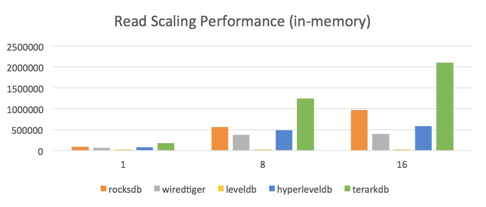

# 1. Terarkdb
TerarkDB is an open source database based on the power of terark storage engine.

TerarkDB is,

- Read optimized, it's quite fast.
- Data is highly compressed and no need to be decompressed before read.
- FSA algorithm based.
- Regex query is supported from the bottom.

TerarkDB's read performance at a glance:



## 2. Dependencies
You need to install these third party libs before start using TerarkDB:

- libboost_system.so.1.60.0, libboost_filesystem.so.1.60.0(both of the lib are included in boost_1_60_0)
- libwiredtiger-2.7.0.so
- libtbb.so.2(tbb44_20160128)
- libTerarkDB-g++-5.3-r.so
- libterark-fsa_all-g++-r.so

`libTerarkDB-g++-5.3-r.so` is open source as you can see, but `libterark-fsa_all-g++-r.so`(Our core algorithm) is not, you can get these two libs from our [official web site](http://www.terark.com/en/products/terark-db).


## 3. Usage
After install all these dependencies, we are ready to go.

### 3.1. Headers
These headers should be included :

```
#include <terark/db/db_table.hpp>
#include <terark/io/MemStream.hpp>
#include <terark/io/DataIO.hpp>
#include <terark/io/RangeStream.hpp>
#include <terark/lcast.hpp>
```

### 3.2. Schema
TerarkDB is a `schema based` NoSQL database, you need to place a `dbmeta.json` in the folder you want to use for db(eg. `/terarkdb/db1/`).

Here's an example of `dbmeta.json`:

```
{
        "RowSchema": {
                "columns" : {
                        "key"   : { "type" : "strzero" },
                        "value" : { "type" : "strzero" }
                }
        },
        "ReadonlyDataMemSize": 1288490188,
        "MaxWrSegSize" : 3221225472,
        "TableIndex" : [
                { "fields": "key"  , "ordered" : true, "unique": false }
        ]
}

```

- `RowSchema.columns` defines fields in the table, in this case we defined `key` and `value`.
- `ReadonlyDataMemSize` and `MaxWrSegSize` is optional for now.
- `TableIndex` defnies indexes on data fields.

You can have only one `dbmeta.json` for every db for now, that means if you want multiple tables, you need to create other database folders, e.g. `/terarkdb/db2`, `/terarkdb/db3`. We will make our APIs much easier to use in the future.

### 3.3. Create database and table
```
terark::db::CompositeTablePtr tab;
static const char* FLAGS_db_table = “DfaDbTable”;
static const char* FLAGS_db = “/terarkdb/db1”;
tab = terark::db::CompositeTable::createTable(FLAGS_db_table);
tab->load(FLAGS_db);
```

`FLAGS_db_table` is the table name, `FLAGS_db` is the folder you choose to store database data and define `dbmeta.json`.

### 3.4. Basic operations
TerarkDB support `write, update, delete`, and you need to create DbContextPtr before any operation:

```
terark::db::DbContextPtr ctx;
ctx = tab->createDbContext()
```

#### 3.4.1. Write
```
terark::NativeDataOutput<terark::AutoGrownMemIO> rowBuilder;
TestRow recRow;
recRow.key = “terarkdb”;
recRow.value = “hello world”;
rowBuilder.rewind();
rowBuilder << recRow;
terark::fstring binRow(rowBuilder.begin(), rowBuilder.tell());
if (ctx->insertRow(binRow) < 0) {
                                printf("Insert failed: %s\n", ctx->errMsg.c_str());
                                exit(-1);
}
```

And `TestRow` is a struct that contains our actual data:

```
terark::NativeDataOutput<terark::AutoGrownMemIO> rowBuilder;
TestRow recRow;
recRow.key = “terarkdb”;
recRow.value = “hello world”;
rowBuilder.rewind();
rowBuilder << recRow;
terark::fstring binRow(rowBuilder.begin(), rowBuilder.tell());
if (ctx->insertRow(binRow) < 0) {
                                printf("Insert failed: %s\n", ctx->errMsg.c_str());
                                exit(-1);
}
```

### 3.4.2 Read
```
terark::valvec<terark::byte> keyHit, val;
terark::valvec<terark::llong> idvec;
valvec<valvec<byte> > cgDataVec;
valvec<size_t> colgroups;

for (size_t i = tab->getIndexNum(); i < tab->getColgroupNum(); i++) {
colgroups.push_back(i);
}

 size_t indexId = 0;
 terark::db::IndexIteratorPtr indexIter = tab->createIndexIterForward(indexId)
 terark::fstring key = “terarkdb”;
 tab->indexSearchExact(indexId, key, &idvec, ctx.get());
 for (auto recId : idvec) {
        tab->selectColgroups(recId, colgroups, &cgDataVec, ctx.get());
 }
```

### 3.4.3. Delete
```
terark::valvec<terark::byte> keyHit, val;
terark::valvec<terark::llong> idvec;

size_t indexId = 0;
terark::db::IndexIteratorPtr indexIter = tab->createIndexIterForward(indexId);
const terark::db::Schema& indexSchema = tab->getIndexSchema(indexId);
terark::fstring key = “terarkdb”;
terark::llong recId;

int ret = indexIter->seekLowerBound(key, &recId, &keyHit);
if (ret == 0) { // found exact key
do {
            assert(recId < tab->numDataRows());
                         idvec.push_back(recId);
              } while (indexIter->increment(&recId, &keyHit)
                                                && terark::fstring(keyHit) == key);
}
 
for (size_t i = 0; i < idvec.size(); ++i) {
recId = idvec[i];
ctx->removeRow(recId);
}
```

### 3.4.4. Exit database
```
CompositeTable::safeStopAndWaitForCompress();
```
